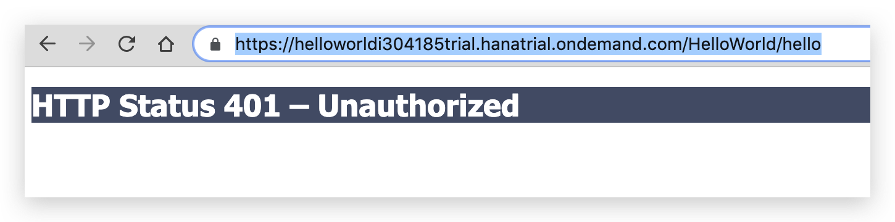

<!-- TOC -->

- [Create a oauth 2.0 security for java application in SAP Cloud Platform Neo Environment](#create-a-oauth-20-security-for-java-application-in-sap-cloud-platform-neo-environment)
    - [Create a java application and deploy in the neo environment](#create-a-java-application-and-deploy-in-the-neo-environment)
        - [1. create a helloworld java app](#1-create-a-helloworld-java-app)
        - [2. Create a web.xml and enable auth configuration](#2-create-a-webxml-and-enable-auth-configuration)
        - [3. Deploy the app in the neo cloud](#3-deploy-the-app-in-the-neo-cloud)
        - [4. Go the hello page](#4-go-the-hello-page)
    - [Register a client in the neo environment](#register-a-client-in-the-neo-environment)
        - [1. Open the cockpit and go to security](#1-open-the-cockpit-and-go-to-security)
        - [2. Register New client](#2-register-new-client)
    - [Create a Scope in the Java Application](#create-a-scope-in-the-java-application)
    - [Test with postman](#test-with-postman)
        - [1. Get the OAuth urls](#1-get-the-oauth-urls)
        - [2. Create a post request in the postman](#2-create-a-post-request-in-the-postman)
        - [3. Use the token in authorization header](#3-use-the-token-in-authorization-header)

<!-- /TOC -->
## Create a oauth 2.0 security for java application in SAP Cloud Platform Neo Environment

In order to protect the resource of java app and the security strategy is always required in the productive environment.

In this tutorial I only use the Client Credentials Crant method to security the Java application with oauth 2.0.

Three steps are needed in the following tutorial.  Create a java application, create a scope for apps and register a oauth client.
### Create a java application and deploy in the neo environment
#### 1. create a helloworld java app
Please following the tutorial guide in the offical guide. [create a hello world application.](https://help.sap.com/viewer/65de2977205c403bbc107264b8eccf4b/Cloud/en-US/e5a8b1d3bb571014a0f89bb4706d4e0b.html)

#### 2. Create a web.xml and enable auth configuration
Create a web.xml  


Copy the configuration in the web.xml.
```xml
<?xml version="1.0" encoding="UTF-8"?>
<web-app xmlns:xsi="http://www.w3.org/2001/XMLSchema-instance"
	xmlns="http://java.sun.com/xml/ns/javaee"
	xmlns:web="http://java.sun.com/xml/ns/javaee"
	xsi:schemaLocation="http://java.sun.com/xml/ns/javaee http://java.sun.com/xml/ns/javaee/web-app_2_5.xsd"
	id="WebApp_ID" version="2.5">
	<login-config>
		<auth-method>OAUTH</auth-method>
	</login-config>
	<security-constraint>
		<web-resource-collection>
			<web-resource-name>Protected Area</web-resource-name>
			<url-pattern>/rest/get-photos</url-pattern>
		</web-resource-collection>
		<auth-constraint>
			<!-- Role Everyone will not be assignable -->
			<role-name>Everyone</role-name>
		</auth-constraint>
	</security-constraint>
	<security-role>
		<description>All SAP Cloud Platform users</description>
		<role-name>Everyone</role-name>
	</security-role>
	
    <servlet>
		<servlet-name>Hello</servlet-name>
		<servlet-class>com.sap.Hello</servlet-class>
	</servlet>

	<filter>
	    <display-name>OAuth scope definition for hello</display-name>
	    <filter-name>OAuthHelloScopeFilter</filter-name>
	    <filter-class>
	      com.sap.cloud.security.oauth2.OAuthAuthorizationFilter
	    </filter-class>
      <!-- Scope which you will used in the following oauth client -->
	  <init-param>
	    <param-name>scope</param-name>
	    <param-value>hello</param-value>
	  </init-param>
	      <init-param>
	    <param-name>no-session</param-name>
	    <param-value>false</param-value>
	  </init-param>
	</filter>
	
    <!-- filter mapping the url pattern which you want to secure in the app -->
	<filter-mapping>
 	   <filter-name>OAuthHelloScopeFilter</filter-name>
 	   <url-pattern>/hello</url-pattern>
	</filter-mapping>
</web-app>=
```
> Please refer the docs [OAuth 2.0 Authorization Code Grant](https://help.sap.com/viewer/65de2977205c403bbc107264b8eccf4b/Cloud/en-US/b7b589334d444293a2a91e0ef4234136.html)

#### 3. Deploy the app in the neo cloud 
[Deploy on the Cloud with the cockpit ](https://help.sap.com/viewer/65de2977205c403bbc107264b8eccf4b/Cloud/en-US/abded969628240259d486c4b29b3948c.html) and make you application start in the neo environment.


#### 4. Go the hello page 
When you go the hello page and you will get a `401` error in the page.


Then we need to set up oauth client to request a oauth token. In the next step we need to setup a client in the neo.


### Register a client in the neo environment
#### 1. Open the cockpit and go to security


#### 2. Register New client
Go Security -> OAuth -> OAuth Settings -> Clients and **Click Register New Client**. 

```
Subscription: <your hello world app>
Authorization Grant: Client Credentials
ID: <Remember it and we use in the postman>
Secret: <passcode>
```


Click Save button and the now the Client has been registered.

### Create a Scope in the Java Application
Set up scope for your protect **helloworld** application.

- In your Web browser, log on to the cockpit, and select an account. See SAP Cloud Platform Cockpit.
- In the `Applications -> Java Applications` section, select the OAuth-protected application.
- For the application, go to the `Security  -> OAuth Scopes` section.
- Choose New Scope.

> Notice: this will take a while to active and please be patient.

### Test with postman
#### 1. Get the OAuth urls
Get the OAuth urls which can find the cockpit OAuth entry. We will use urls in the postman to get token.


#### 2. Create a post request in the postman
Create a post request in the postman

input the url with Token Endpoint which we got in the cockpit. Append the two query string in the url: `grant_type=client_credentials` and `scope=hello`.

>Grant_type is your client type and scope is set in the web.xml.

```
url: https://oauthasservices-i304185trial.hanatrial.ondemand.com/oauth2/api/v1/token?grant_type=client_credentials&scope=hello
```

Click the send button you will get token in body of postman.


#### 3. Use the token in authorization header 
Create a another get request for your helloworld service.

```
url: https://helloworldi304185trial.hanatrial.ondemand.com/HelloWorld/hello
```
Select Authorization type `Bearer Token` and input the token you get from last request.


Finally it works.


